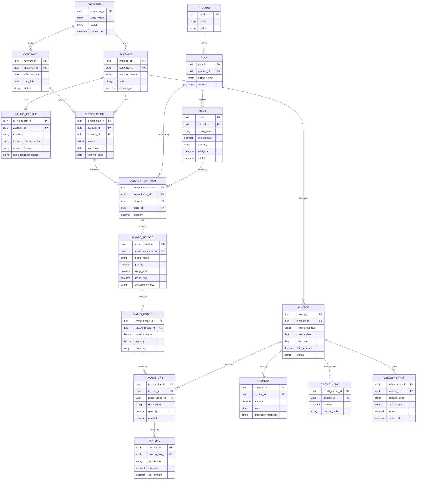

# Domain Model and Entity Relationships

## Core Entities

| Entity | Description |
|---|---|
| Customer | Legal or commercial customer entity. |
| Account | Billing account under a customer. |
| BillingProfile | Invoice delivery, currency, tax, and payment settings. |
| Product | Sellable product family. |
| Plan | Commercial plan for a product. |
| Price | Versioned pricing rule for a plan or charge. |
| Contract | Enterprise commercial agreement. |
| Subscription | Active recurring entitlement under an account or contract. |
| SubscriptionItem | Product, plan, quantity, and pricing component. |
| UsageRecord | Raw or normalized metered usage. |
| RatedUsage | Usage transformed into billable charges. |
| Invoice | Legal billing document. |
| InvoiceLine | Billable line item on an invoice. |
| TaxLine | Tax amount associated with invoice lines. |
| Payment | Payment attempt or captured payment. |
| CreditMemo | Credit applied against invoice balance. |
| LedgerEntry | Immutable accounting movement. |

## Mermaid Entity Relationship Diagram

## Aggregate Boundaries

| Aggregate | Root | Notes |
|---|---|---|
| Customer Aggregate | Customer | Owns customer profile and account references. |
| Billing Account Aggregate | Account | Owns billing profile, payment terms, invoice preferences. |
| Subscription Aggregate | Subscription | Owns subscription items and lifecycle state. |
| Invoice Aggregate | Invoice | Owns invoice lines, tax lines, invoice totals, status transitions. |
| Payment Aggregate | Payment | Owns payment attempt lifecycle and processor references. |
| Ledger Aggregate | LedgerEntry | Immutable accounting postings. |
