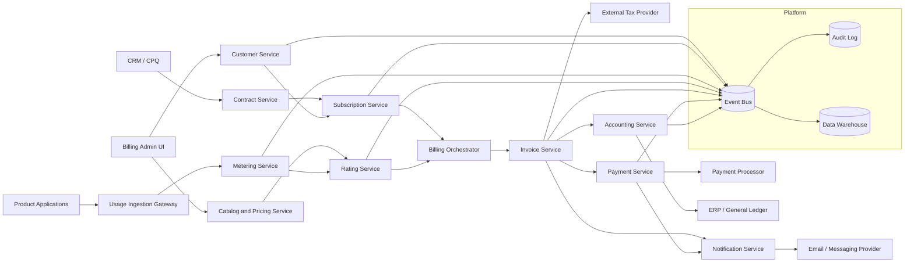

# Architecture

## Logical Architecture

## Services

| Service | Responsibility |
|---|---|
| Customer Service | Customers, accounts, billing profiles, contacts |
| Catalog and Pricing Service | Products, plans, prices, rate cards |
| Contract Service | Contract terms, effective dates, amendments |
| Subscription Service | Subscription lifecycle, plan changes, renewals |
| Usage Ingestion Gateway | Authenticated usage intake and idempotency |
| Metering Service | Usage validation, normalization, aggregation |
| Rating Service | Converts charges and usage into rated amounts |
| Billing Orchestrator | Coordinates billing runs and retries |
| Invoice Service | Invoice drafts, finalization, taxes, credits |
| Payment Service | Payment methods, collections, refunds |
| Accounting Service | Ledger entries, revenue schedules, GL export |
| Notification Service | Invoice delivery, reminders, dunning |

## Data Stores

| Store | Suggested Technology | Purpose |
|---|---|---|
| Operational DB | PostgreSQL / SQL Server | Strongly consistent billing records |
| Event Store | Kafka / EventStoreDB | State transitions and audit events |
| Object Store | S3 / Blob Storage | Invoice PDFs and exported files |
| Analytics Store | Snowflake / BigQuery | Reporting and warehouse analytics |
| Cache | Redis | Rate card cache, idempotency locks |
| Search | OpenSearch / Elasticsearch | Invoice and customer search |

## Deployment Model

- Each bounded context can be a separately deployable service.
- Financial write paths should prefer transactional consistency.
- High-volume metering and usage ingestion should be horizontally scalable.
- Billing runs should execute through durable jobs with retry and checkpointing.
