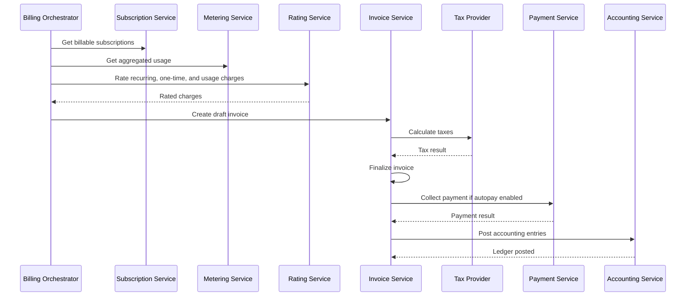
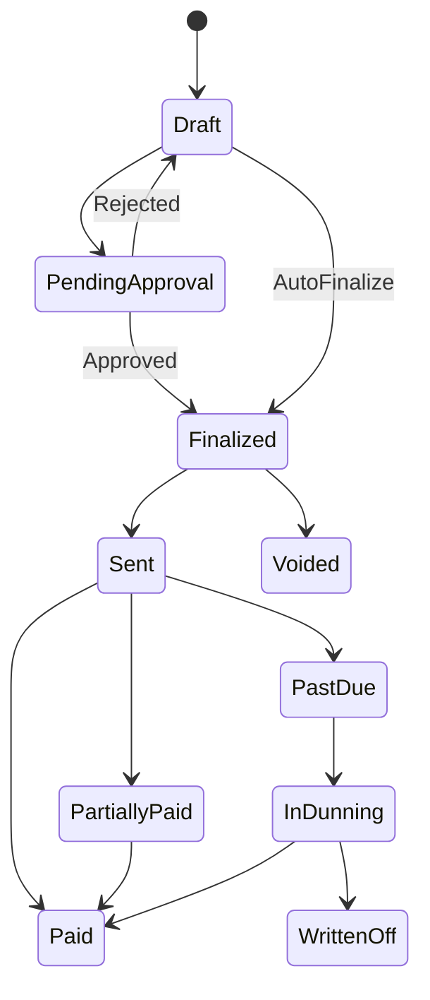

# Billing Lifecycle and Workflows

## Subscription Billing Flow



## Invoice State Machine



## C# Pseudocode — Billing Run

```csharp
public sealed class BillingRunService
{
    private readonly ISubscriptionRepository _subscriptions;
    private readonly IUsageMeteringService _usage;
    private readonly IRatingService _rating;
    private readonly IInvoiceService _invoices;
    private readonly IPaymentService _payments;
    private readonly IAccountingService _accounting;

    public async Task RunAsync(BillingRunCommand command, CancellationToken ct)
    {
        var subscriptions = await _subscriptions.GetBillableAsync(
            command.BillingPeriodStart,
            command.BillingPeriodEnd,
            ct);

        foreach (var subscription in subscriptions)
        {
            var idempotencyKey = $"billing-run:{command.RunId}:subscription:{subscription.Id}";

            if (await _invoices.ExistsForIdempotencyKeyAsync(idempotencyKey, ct))
            {
                continue;
            }

            var usage = await _usage.GetAggregatedUsageAsync(
                subscription.Id,
                command.BillingPeriodStart,
                command.BillingPeriodEnd,
                ct);

            var ratedCharges = await _rating.RateAsync(subscription, usage, ct);

            var invoice = await _invoices.CreateDraftAsync(new CreateInvoiceRequest
            {
                AccountId = subscription.AccountId,
                SubscriptionId = subscription.Id,
                BillingPeriodStart = command.BillingPeriodStart,
                BillingPeriodEnd = command.BillingPeriodEnd,
                Charges = ratedCharges,
                IdempotencyKey = idempotencyKey
            }, ct);

            invoice = await _invoices.FinalizeAsync(invoice.Id, ct);

            if (invoice.AutoPayEnabled)
            {
                await _payments.CollectAsync(invoice.Id, invoice.AmountDue, ct);
            }

            await _accounting.PostInvoiceAsync(invoice.Id, ct);
        }
    }
}
```

## Dunning Flow

1. Invoice becomes past due.
2. Payment retry schedule starts.
3. Customer receives reminder notifications.
4. Account may enter restricted state.
5. Collections or write-off workflow begins if unresolved.
